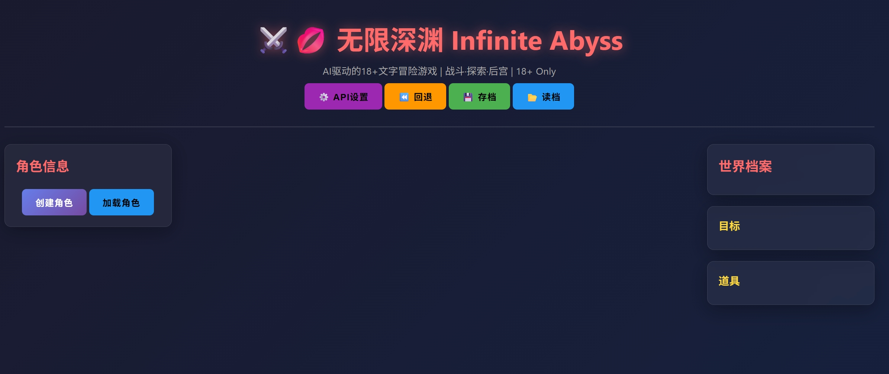
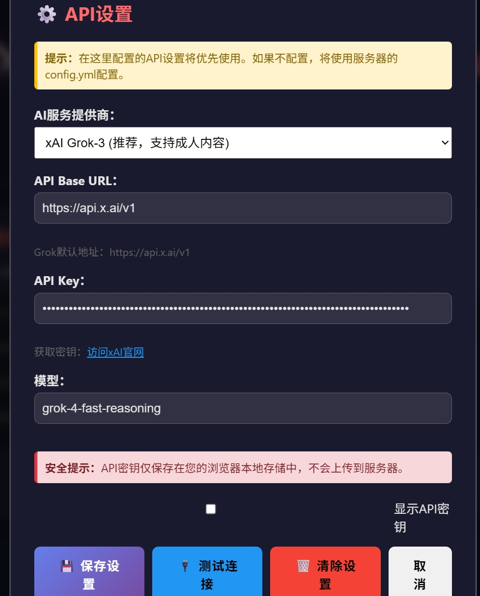
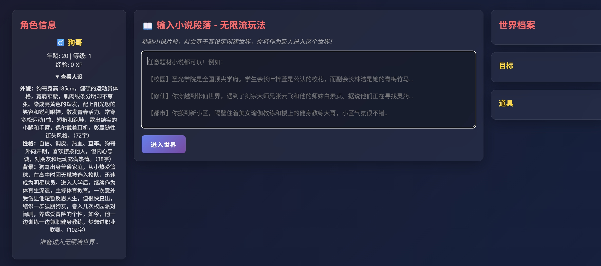
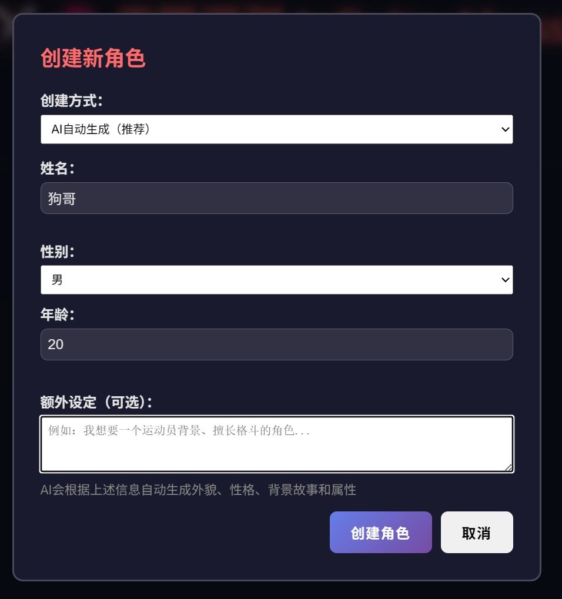
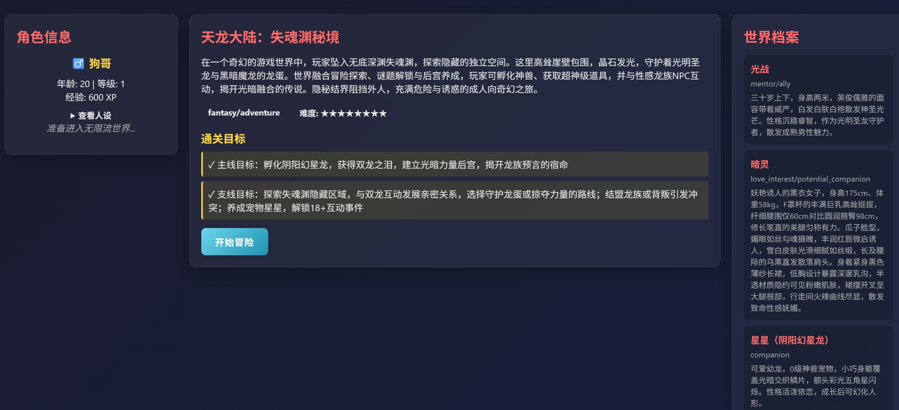
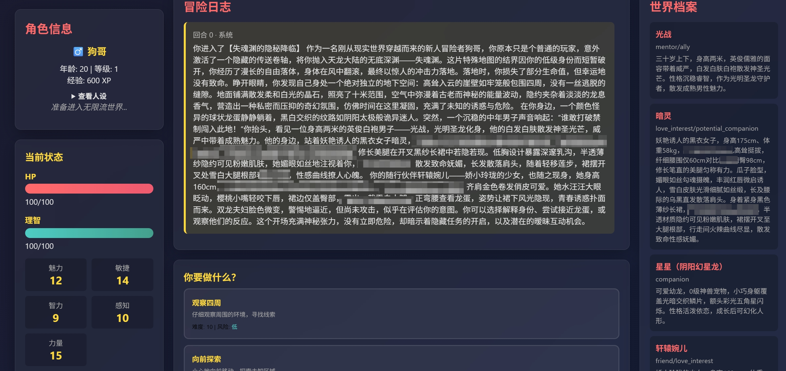

# 无限深渊 - Infinite Abyss

**中文** | [English](README_EN.md)

## 🔞 18+ 成人向无限流冒险

<div align="center">


**开源的AI驱动18+文字冒险游戏**

[](https://go.dev/)
[](https://x.ai/)
[](README.md)
[](README.md)

[🎯 **立即开始**](#-快速开始) | [🤝 **共同创作**](#-参与共创)

---

**📝 关于本项目**: 受《无限恐怖》等无限流小说启发，这是一个完全开源的AI驱动18+文字冒险游戏。输入任意成人小说或动漫片段，AI自动生成可探索的冒险世界。我们邀请所有开发者、作家、玩家一起共创，让游戏变得更好。

**⚠️ 重要声明**: 
- 🔞 本项目仅供18岁及以上成年人使用
- 🚫 **严禁将本项目用于任何商业盈利目的**
- 📖 本项目仅供学习研究和个人娱乐使用
- ⚖️ 使用者需遵守所在地区的法律法规

</div>

---

一个开源的AI驱动18+文字冒险游戏，基于Go和现代Web技术开发。**主打在成人小说和18+动漫世界中的冒险体验**。玩家可以输入任意小说/动漫片段（推荐18+内容），AI会自动生成可探索的冒险世界。结合D20检定系统、角色成长、战斗探索和成人向互动，在无尽的世界中体验无限的冒险。

## 📸 项目效果预览

<div align="center">

### 1️⃣ 主界面



### 2️⃣ API设置



### 3️⃣ 输入小说段落



### 4️⃣ 角色生成



### 5️⃣ 进入世界



### 6️⃣ 开始冒险



*实际游戏中的交互效果*

</div>

## 🌟 项目特色

### 🎮 创新的无限流玩法

* **18+世界探索**: 主打成人小说和18+动漫世界，在你喜爱的成人作品中开启冒险
* **任意内容输入**: 粘贴成人小说/动漫片段，AI自动解析世界观、人物和设定
* **AI世界生成**: 基于原文自动创建可探索的成人向开放世界
* **动态剧情**: AI根据你的选择实时生成后续故事内容
* **多题材支持**: 成人奇幻、后宫系、恋爱、NTR、调教...无限可能

### ⚔️ 真实的TRPG体验

* **D20检定系统**: 经典龙与地下城规则，每个行动都有风险和回报
* **属性系统**: 力量、敏捷、智力、魅力、感知 - 多维度角色养成
* **战斗系统**: 真实的HP、伤害计算、暴击和大失败
* **成长机制**: 经验值、升级、技能树、装备系统

### 💋 成人向互动系统

* **角色攻略**: 与世界中的性感角色建立关系
* **多层次互动**: 与AI角色进行丰富的对话和互动
* **后宫养成**: 招募队友，建立你的冒险团队 *（待开发）*
* **动态好感度**: 基于你的行动和选择影响角色态度 *（待开发）*

### 🧠 智能AI系统
* **上下文记忆**: AI记住所有历史互动，保持故事连贯性(待开发)
* **智能选项生成**: 根据当前情境动态生成合理的行动选项
* **自然语言叙事**: 生动描写战斗、探索和成人向互动场景

### 🎲 完善的游戏功能

* **前端API配置**: 网页直接配置API密钥，无需修改服务器配置文件
* **存档/读档系统**: 随时保存和加载游戏进度
* **回退功能**: 对结果不满意？一键回退到上一回合
* **角色创建**: AI辅助生成或手动创建你的专属角色
* **持久化存储**: SQLite数据库保存所有游戏数据

## 🛠️ 技术栈

* **后端语言**: Go 1.21+
* **Web框架**: Gin
* **AI服务**: xAI Grok-3 API
* **数据存储**: SQLite 3
* **前端技术**: HTML5 + CSS3 + Vanilla JavaScript
* **配置格式**: YAML

## 📋 系统要求

### 开发/运行环境
* Go 1.21或更高版本

### 注意事项
* 需要有效的xAI Grok API密钥才能正常使用
* 浏览器推荐使用Chrome、Edge、Firefox或Safari最新版本

## 🚀 快速开始

### 1. 克隆项目
```bash
git clone https://github.com/你的用户名/AIwuxian.git
cd AIwuxian
```

### 2. 获取Grok API密钥
1. 访问 [xAI官网](https://x.ai/) 注册账号
2. 前往API密钥管理页面创建新密钥
3. 复制API密钥（格式类似：`xai-xxxxxxxxxxxxxx`）

### 3. 配置API
1. 复制配置模板：`cp config.example.yml config.yml`
2. 编辑 `config.yml`，填入你的Grok API密钥
3. **重要**: 目前仅支持xAI Grok-3，其他AI服务暂不支持成人内容生成
4. 配置示例：

```yaml
llm:
  provider: "openai"
  api_key: "xai-your-grok-api-key-here"
  api_base: "https://api.x.ai/v1"
  model: "grok-3"
  temperature: 0.7
  max_tokens: 2000

server:
  port: 8080
  host: "0.0.0.0"

game:
  enable_adult_mode: true
```

### 4. 启动服务器
```bash
# 直接运行
go run cmd/server/main.go

# 或编译后运行
go build -o infinite-abyss.exe cmd/server/main.go
./infinite-abyss.exe

# Windows用户可以使用启动脚本
start.bat
```

### 5. 开始游戏
打开浏览器访问：`http://localhost:8080`

### 6. 在网页中配置API（可选）
除了在config.yml中配置，你还可以直接在网页中配置API：

1. 点击页面顶部的「⚙️ API设置」按钮
2. 输入你的Grok API密钥和配置
3. 点击「🔌 测试连接」验证配置是否正确
4. 点击「💾 保存设置」保存配置

**注意**：网页中的配置将优先使用，保存在浏览器本地存储中，不会上传到服务器。

## 🎯 使用说明

### 基本操作
1. **创建角色**：AI辅助生成或手动创建你的冒险者
2. **输入小说/动漫片段**：粘贴18+成人小说或动漫内容（推荐成人向作品）
3. **AI生成世界**：系统自动解析并创建可探索的成人向世界
4. **开始冒险**：选择行动选项或输入自定义行动
5. **D20检定**：每个行动都有成功率，掷骰子决定结果
6. **体验剧情**：战斗、探索、与角色互动、建立亲密关系


### 核心玩法
* **D20检定系统**：经典TRPG规则，每个行动根据难度进行检定
* **属性成长**：力量、敏捷、智力、魅力、感知五维属性
* **战斗探索**：真实的战斗系统，HP/经验值/升级机制
* **角色互动**：与AI角色建立关系，解锁特殊剧情（待开发）
* **存档系统**：随时保存/读档，支持回退到上一回合

## 🔧 开发指南

### 项目结构
```
AIwuxian/
├── cmd/server/         # 服务器入口
├── internal/
│   ├── api/           # HTTP接口
│   ├── models/        # 数据模型
│   ├── services/      # 核心服务
│   └── storage/       # 数据存储
├── web/               # Web前端
├── data/              # 数据库文件
└── config.yml         # 配置文件
```

### 核心系统
* **StoryService**: 故事生成和管理
* **RuleEngine**: D20检定和规则系统
* **LLMService**: Grok AI集成
* **WorldService**: 世界解析和生成
* **Storage**: 数据持久化

### 扩展开发
* 添加新的行动类型和检定规则
* 自定义世界生成提示词
* 扩展角色属性和技能系统
* 集成图片生成（角色立绘）
* 添加语音合成（角色配音）

## 🤝 参与共创

欢迎贡献代码！请遵循以下步骤：

1. Fork本项目
2. 创建特性分支 (`git checkout -b feature/AmazingFeature`)
3. 提交更改 (`git commit -m 'Add some AmazingFeature'`)
4. 推送到分支 (`git push origin feature/AmazingFeature`)
5. 创建Pull Request

### 特别欢迎

* 🎨 **美术设计师** - UI设计、角色立绘、场景插图
* 💻 **开发者** - 新功能开发、性能优化、Bug修复
* ✍️ **作家/编剧** - 剧情设计、对话优化、世界观构建
* 🎮 **玩家** - 游戏测试、反馈建议、创意分享

## ⚠️ 免责声明与使用限制

### 🔞 年龄限制
- 本项目包含成人向内容，**严格限制18岁以下人士使用**
- 使用者需自行确认已达到所在地区的法定成年年龄

### 🚫 禁止商业使用
- **严禁将本项目用于任何形式的商业盈利活动**
- 包括但不限于：付费运营、广告盈利、会员制服务、商业授权等
- 本项目仅限个人学习、研究和非商业娱乐使用


### ⚖️ 法律责任
- 本项目生成的所有内容由AI创作，不代表开发者立场和观点
- 使用者需自行承担使用本项目产生的一切法律责任
- 使用者必须遵守所在地区关于成人内容的相关法律法规
- 开发者不对使用本项目造成的任何直接或间接损失负责

### 🔐 隐私与数据
- 所有数据保存在本地，不上传到任何服务器
- 使用Grok API需遵守xAI的服务条款和隐私政策
- 用户需自行保护API密钥和个人数据安全

### 🤖 AI服务说明
- **当前支持**: 仅支持xAI Grok-3
- **供应商限制**: OpenAI、Anthropic、Google等主流AI服务商均不支持18+成人内容生成
- **未来计划**: 待OpenAI推出GPT承认模式后，将考虑支持更多AI服务
- **服务费用**: 使用Grok API会产生费用，请自行前往xAI官网查看定价

### 📝 内容规范
- 禁止生成涉及未成年人的任何不当内容
- 禁止生成违反法律法规的内容
- 禁止生成涉及暴力、歧视、仇恨言论等有害内容

### 🛡️ 使用声明
**继续使用本项目即表示您已阅读、理解并同意遵守以上所有条款。**

---

**注意**: 使用本项目需要有效的xAI Grok API密钥。请合法合规使用，共同维护良好的开源社区环境。
